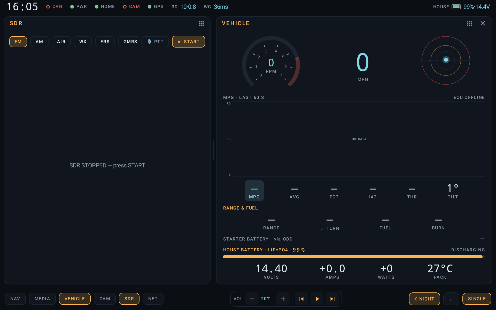
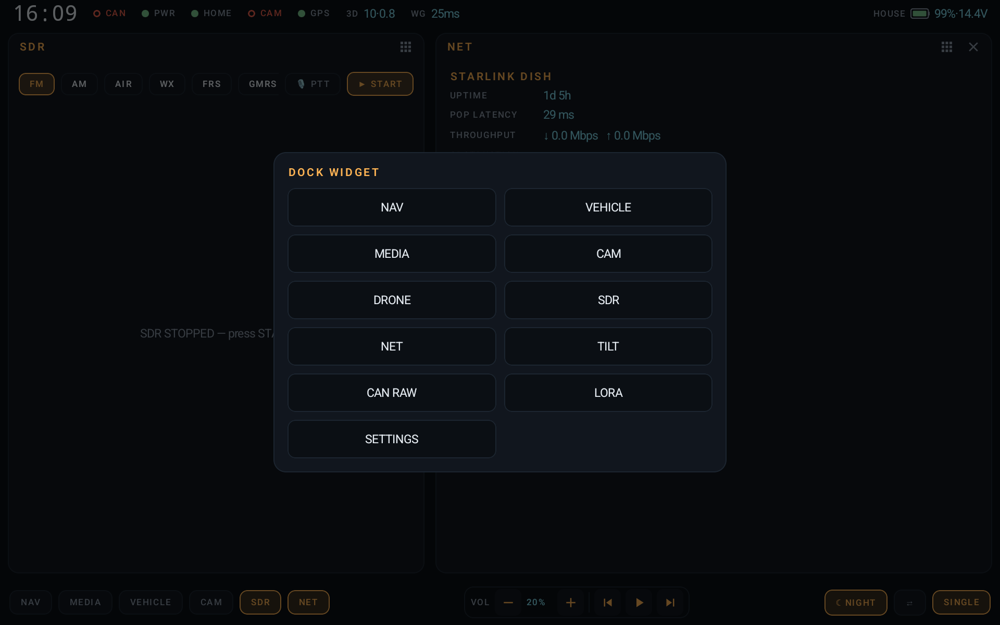
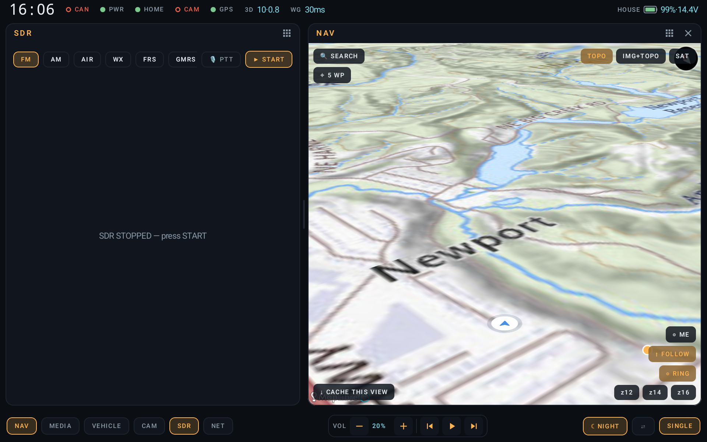
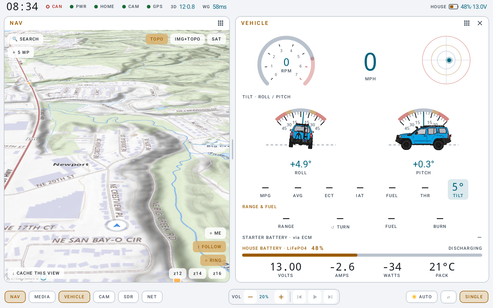
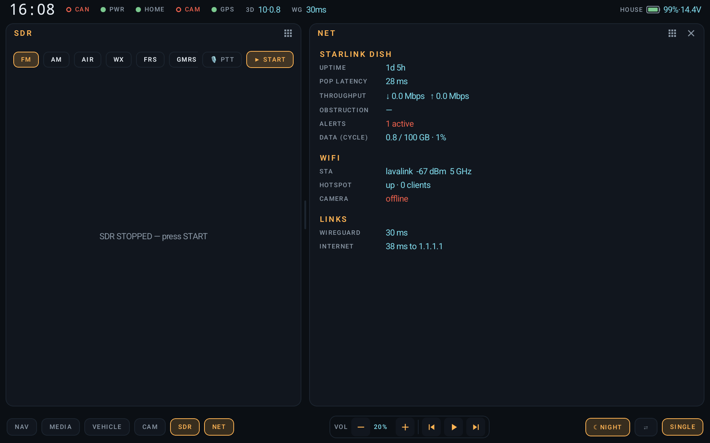
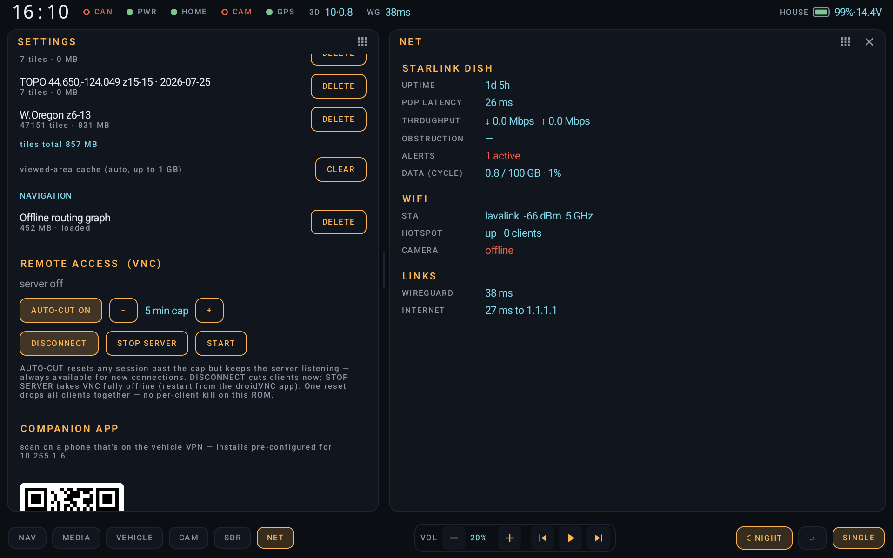
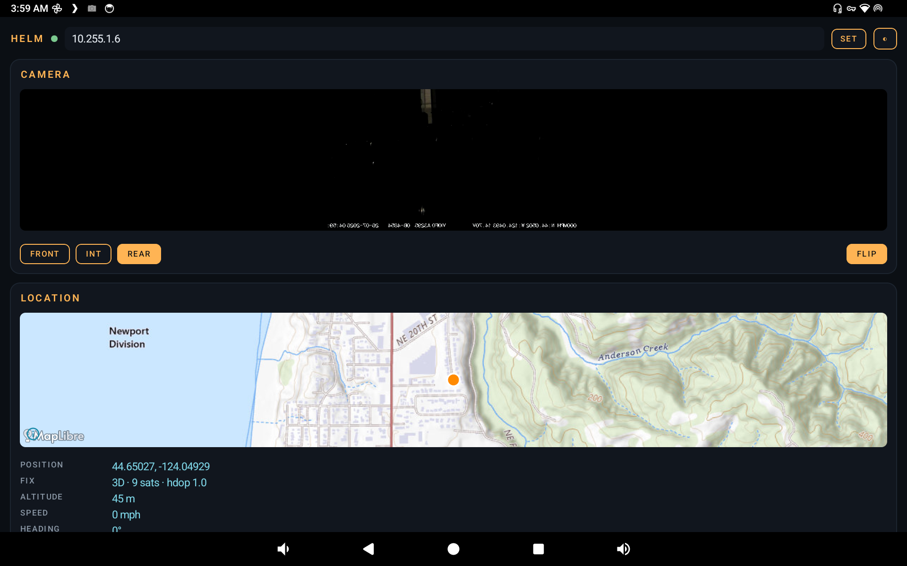
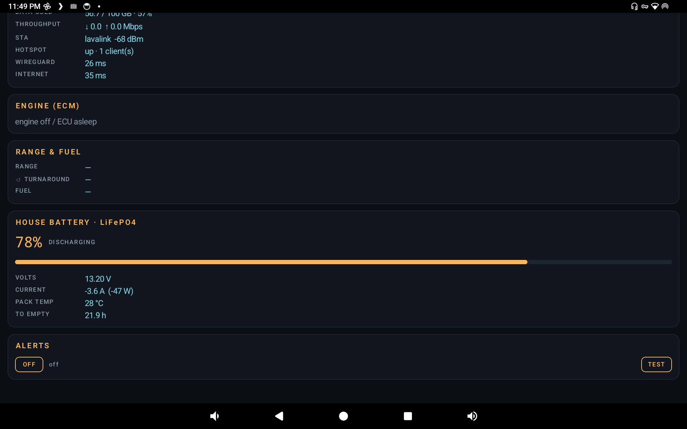

# Helm

**A custom Android 14 head-unit dashboard for a recon / emergency-operations
vehicle** — a 2008 Nissan Xterra built out with a Khadas Edge2 (RK3588), a 10"
landscape multitouch screen, house-battery power (always on), full-time Starlink,
and a vehicle LAN. Helm replaces the Android launcher and runs kiosk-style: one
pane of glass for navigation, engine data, cameras, radio spectrum, house power,
and networking, dockable side-by-side.



**Design language: "instrument glass."** Deep blue-black panels, phosphor-amber
for controls (night-vision safe), glacier-cyan for live data, red reserved for
genuine alerts. Monospace numerals so gauges never jitter. The theme flips
day/night automatically from solar elevation. Two big panes with a draggable
divider instead of a desktop window manager — at arm's length in a moving truck,
two targets you can hit blind beat ten you can't.

> **Status:** running on the vehicle. This started as a single-session design
> generation and has since been built, deployed, and iterated on the actual
> Edge2 hardware. Some hardware-facing paths are still marked below where they
> await bench verification.

---

## Table of contents

- [The two-pane dock](#the-two-pane-dock)
- [Navigation](#navigation)
- [Vehicle / OBD](#vehicle--obd)
- [Attitude (inclinometer)](#attitude-inclinometer)
- [SDR / radio](#sdr--radio)
- [Cameras](#cameras)
- [Media](#media)
- [Networking (Starlink + WiFi)](#networking-starlink--wifi)
- [House power](#house-power)
- [Settings: offline cache, remote access, companion](#settings-offline-cache-remote-access-companion)
- [Phone companion app](#phone-companion-app)
- [Architecture](#architecture)
- [Build](#build)
- [Device setup & hardware](#device-setup--hardware)
- [Security & privacy](#security--privacy)
- [Documentation map](#documentation-map)

---

## The two-pane dock

Every feature is a **widget**; any widget docks into either of the two panes,
picked from the dock bar or the widget catalog. Panes resize with a draggable
divider. Widgets are dumb `StateFlow` collectors, so the layout is free — a
widget can go anywhere without touching the data layer.



## Navigation

MapLibre Native with **USGS Topo** draped over a 3D terrain mesh, keyless.
Fully offline-capable: regional tile downloads (e.g. all of Western Oregon) plus
an embedded **GraphHopper** routing graph give turn-by-turn with voice with no
connectivity. Address/business **search** uses the keyless Photon geocoder online
but routes offline. Waypoints are categorized (waypoint / **fuel** / **base**),
color-coded, and drive a **round-trip range ring** ("how far can I go and still
get back on the fuel aboard") plus a **reserve alert** when the range no longer
reaches the nearest fuel/base.



## Vehicle / OBD

Live engine data over a USB ELM327 at ~8 Hz — RPM, speed, coolant/intake temps,
throttle, MAF-derived instant & trip **MPG**, fuel level, DTCs. Derived on top
(see [`docs/PROPOSALS.md`](docs/PROPOSALS.md) Tier 1): **drivable range**,
round-trip radius, fuel gallons, idle-endurance (engine-as-generator), and an
**alternator/charge-system verdict** from the bus voltage. A top-down **level
bubble** rides alongside RPM/MPH. The right pane of the [hero shot](#helm) shows
the full vehicle pane: instrument row, tap-selectable 60 s trend, ECM stat tiles,
RANGE & FUEL, starter + house battery.

## Attitude (inclinometer)

Off-road roll/pitch from the head unit's accelerometer, rendered as truck
silhouettes rotating against a fixed horizon with warn/danger protractor bands,
live numerals, session peaks, and a combined tilt bubble.



## SDR / radio

An RTL-SDR over `rtl_tcp` drives a live **spectrum + waterfall**, WBFM/NBFM/AM
demod to the speakers, and a per-band channel browser for the voice-comms
services — **FM / AM / AIR / WX / FRS / GMRS / MURS / marine / CB / 2 m / 70 cm**
— with accurate US channel plans, carrier squelch (hysteresis), CTCSS/PL tone
decode, per-service scan, and an antenna/λ info panel. A TX scaffold is in place
for a future transmit-capable SDR. (Band selector visible in the [hero shot](#helm).)

## Cameras

RTSP camera panes via low-latency LibVLC — three Viofo A329 views (front / cabin
/ rear) plus a drone FPV source and a nestable thermal (UVC) view. The **rear
camera takes the whole screen automatically the instant reverse engages**,
regardless of foreground app (an overlay service), then releases.

## Media

Universal transport control over Android `MediaSession` (YouTube Music, Audible,
NPR One, VLC, anything), plus rich Spotify control via the App Remote SDK. Reads
now-playing from the notification listener; nothing leaves the device.

## Networking (Starlink + WiFi)

Starlink dish health straight off the local gRPC API (uptime, PoP latency,
throughput, obstruction, alerts), a locally-integrated **data-usage** meter for
the billing cycle, WiFi STA/hotspot status, and WireGuard/Internet reachability.



## House power

The house battery is *the* battery. `power/RenogyBleClient` speaks Renogy's
Modbus-over-GATT (smart battery or BT-2 controller) for SOC / V / signed A /
Ah / per-cell / temp / runtime, and **mirrors SOC into Android's BatteryService**
so the OS status bar and every app report the house pack, not a nonexistent
internal cell.

## Settings: offline cache, remote access, companion

DataStore-backed settings: offline **map-tile regions** and the routing graph
(with sizes + per-region delete), a **VNC remote-access guard** that caps stale
screen-share sessions (a forgotten viewer once streamed ~59 GB over Starlink —
now auto-cut at a configurable minute cap, resetting the session at the netfilter
layer while keeping the server listening), the Unraid waypoint-backup config, and
a **QR to install the phone companion** pre-configured for the vehicle VPN.



## Phone companion app

[`helm-companion`](https://github.com/uberclokr/helm-companion) is a thin
phone-side read view over the WireGuard VPN — live cameras, a map of the vehicle position, engine/network/power
readouts, RANGE & FUEL, and background **threshold alerts** (house battery SOC,
pack temperature) via local notifications. Shares Helm's instrument-glass theme.




---

## Architecture

```
HelmApp (service locator — owns every repository)
 ├── CanRepository ─ Elm327Manager (USB OBD) + GpioReverseSensor ─▶ VehicleState
 │      └─ VehicleEnergy (pure: range / fuel / alternator, unit-tested)
 ├── GpsRepository ─ USB u-blox (usb-serial) ─▶ GpsFix (+ system mock provider)
 ├── NavRepository ─ GraphHopper (offline routing) + Photon (online geocode)
 ├── PoiStore ─ waypoint GeoJSON (wp/fuel/base) + Unraid SFTP sync
 ├── MediaRepository ─ MediaSessionManager (+ NotificationListener) / SpotifyRemote
 ├── CameraRegistry ─ RtspView (LibVLC) / ThermalView (UVC) / ReverseOverlayService
 ├── SdrRepository ─ RtlTcpClient → Dsp (FFT + demod) → AudioTrack + waterfall
 ├── BatteryRepository ─ RenogyBleClient (Modbus/GATT) → SystemBatteryBridge
 ├── TiltRepository ─ accelerometer → roll/pitch
 ├── NetRepository / StarlinkClient / HomeLinkRepository ─ links + dish health
 ├── VncManager ─ root watchdog capping stale screen-share sessions
 └── VehicleService (foreground, START_STICKY, boot receiver)
        ├── ReverseOverlayService (auto rear-cam overlay)
        └── ApiServer (:8080) + RtspRelay (:8554)  ← the companion's back end
```

Every subsystem is a repository exposing `StateFlow`; widgets collect and render.
No DI framework — `HelmApp` is the locator. All external I/O lives in
`Dispatchers.IO` with infinite retry/backoff; nothing crashes the process on link
loss. Pure logic (`Dsp`, `VehicleEnergy`, Modbus CRC, ELM/NMEA parsing) is
unit-tested (`app/src/test/`).

## Build

```bash
./gradlew :app:assembleDebug          # Android SDK 34
adb install -r app/build/outputs/apk/debug/app-debug.apk
adb logcat -s Helm AndroidRuntime
```

Prerequisites:
- `app/libs/spotify-app-remote-release-0.8.0.aar` (Spotify GitHub releases) — for
  rich Spotify control; universal transport works without it.
- `secret.properties`: `HELM_API_TOKEN=<shared token>` — the bearer the companion
  presents to the status API. **Gitignored; never commit it.**
- `local.properties`: `MAPS_API_KEY=<key>` (only if using the Google basemap;
  MapLibre/USGS needs no key).
- Device one-time: freeform windowing, GPIO export for the reverse tap, root.

## Device setup & hardware

See [`docs/HARDWARE.md`](docs/HARDWARE.md) for wiring and the bench checklist.
In brief:

- **OBD:** any CH340/FTDI/CP2102 ELM327 USB dongle; a genuine OBDLink SX drops far
  fewer fast-poll responses than clones.
- **Reverse tap:** reverse-lamp 12 V → optocoupler → GPIO (never feed 12 V near
  the hat); set the pin in `GpioReverseSensor`.
- **Cameras:** static DHCP leases for the Viofo A329s; verify RTSP paths with
  `ffprobe`; set in `CameraRegistry`.
- **RTL-SDR:** an `rtl_tcp` source on `127.0.0.1:1234` (the SDR Driver app or
  Termux); Helm auto-connects on opening the SDR pane.
- **House battery:** find the Renogy MAC (nRF Connect), set `mac`/`kind` in
  Settings/`BatteryRepository`.

After any OS update, re-run `~/Scripts/POST-UPDATE-README.md` on the host (this is
an atomic/immutable SteamOS-adjacent flow — see the host `CLAUDE.md`).

## Security & privacy

Helm's traffic profile is deliberately quiet — **no analytics, crash, or
telemetry SDKs**; the only third-party egress is keyless map tiles (USGS/AWS) and
the Photon geocoder on explicit searches. A full audit, including the known open
items (unauthenticated LAN RTSP relay, status-API hardening, AP-credential
strength, and the exported debug broadcasts), is documented in
[`SECURITY.md`](SECURITY.md). Read it before exposing anything beyond the
WireGuard VPN.

## Documentation map

- [`CLAUDE.md`](CLAUDE.md) — the working contract: mission, architecture rules,
  honest status, do-nots. **Start here for development.**
- [`docs/FEATURES.md`](docs/FEATURES.md) — per-feature spec, acceptance criteria.
- [`docs/ROADMAP.md`](docs/ROADMAP.md) — phased priorities.
- [`docs/PROPOSALS.md`](docs/PROPOSALS.md) — designed-but-unbuilt capabilities
  (OBD-derived features, the RTK-base → drone-corrections integration).
- [`docs/HARDWARE.md`](docs/HARDWARE.md), [`docs/SOCKETCAN.md`](docs/SOCKETCAN.md),
  [`docs/THERMAL.md`](docs/THERMAL.md), [`docs/NAV_OFFLINE.md`](docs/NAV_OFFLINE.md)
  — subsystem guides.
- [`SECURITY.md`](SECURITY.md) — security & privacy review.
</content>
